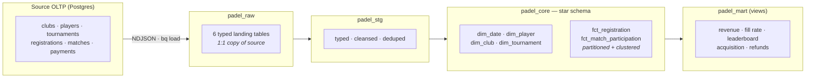
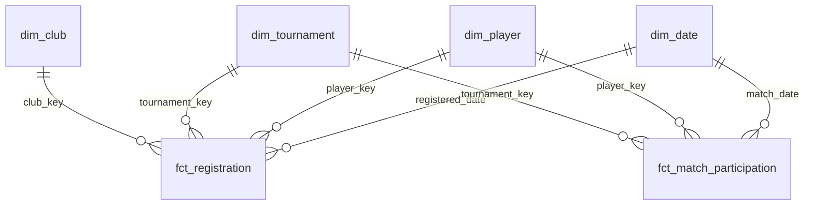

# Padel Analytics Warehouse (Google BigQuery)

A small but complete analytics data warehouse on **Google BigQuery**. It maps data
out of an **existing relational (Postgres) source database** and models it into a
clean **star schema**, then serves business questions through a set of marts.

Built to demonstrate an end-to-end cloud-warehouse workflow: **source mapping →
raw landing → staging/cleansing → conformed dimensions & facts → analytics marts**,
with data-quality tests and BigQuery-native performance features (partitioning,
clustering).

The domain is padel-tournament management (players, tournaments, matches, payments).
The pipeline runs end-to-end with **synthetic seed data** so no live database or
cloud account is needed to try it; point the loader at a real export to run it for real.

---

## Architecture

Data flows through four BigQuery layers, each `CREATE OR REPLACE` built purely from
the one before it — so the whole pipeline is **idempotent and re-runnable**.



## Star schema

Two fact grains share conformed dimensions (classic star). `fct_match_participation`
is built by unpivoting the four player slots on each match, so player-level win rates
are a plain `GROUP BY` rather than four-way OR logic.



| Table | Grain | Key measures / attributes |
|-------|-------|---------------------------|
| `fct_registration` | one row per team registration | `net_revenue_aud`, `is_paid`, `payment_status` |
| `fct_match_participation` | one row per player per match | `win_flag`, `round`, `team` |
| `dim_player` | player | country, gender, `age_band`, `joined_date` |
| `dim_tournament` | tournament | category, surface, `entry_fee_aud`, club attributes |
| `dim_club` | club | city, country |
| `dim_date` | calendar day | year / quarter / month / weekend flags |

## What it demonstrates

- **Source-to-warehouse mapping** from an existing relational schema (the core Amplifon-style task).
- **Dimensional modelling** — conformed dimensions + fact grains chosen deliberately.
- **Data cleansing in staging** — trims, country/gender normalisation, `SAFE_DIVIDE`,
  and deduplication with `ROW_NUMBER()` (the source seeds real dirt to clean).
- **BigQuery performance features** — facts `PARTITION BY` event date and `CLUSTER BY`
  the common filter keys, so month/tournament queries stay cheap.
- **Data-quality testing** — `tools/validate.mjs` gates PK uniqueness, referential
  integrity, and value domains before anything is trusted.

## Run it locally (no cloud, just Node)

```bash
node tools/generate.mjs        # write synthetic source data to ./data
node tools/validate.mjs        # data-quality gate (PK / FK / domains)
node tools/expected_metrics.mjs# headline metrics, straight from source
# or: make local   /   npm run local
```

`expected_metrics.mjs` recomputes the mart numbers independently of the SQL, so
after you deploy, the BigQuery marts must reconcile to it — the same source-vs-
warehouse sign-off you'd do on a real migration. Example run:

```
Registrations: 719  |  paid: 573
Total net revenue: A$43,640
Average tournament fill rate: 73.8%
Refund rate by provider:  stripe 7.0%   paypal 3.2%
```

## Publish to BigQuery Sandbox (free, no billing, no local install)

The [BigQuery Sandbox](https://cloud.google.com/bigquery/docs/sandbox) gives you real
BigQuery with **no credit card and no charges** (10 GB storage + 1 TB queries/month free;
tables auto-expire after 60 days). Run the whole pipeline from **Google Cloud Shell**,
which ships with `bq`, `git`, `node`, and `make` already authenticated as you.

1. Open the [BigQuery console](https://console.cloud.google.com/bigquery) and, if
   prompted, accept the free **Sandbox** (creates a project id like `my-first-project-123456`).
2. Open [Cloud Shell](https://shell.cloud.google.com) (terminal icon, top-right).
3. Clone and deploy — one block:

```bash
git clone https://github.com/kplofts/padel-bigquery-warehouse.git
cd padel-bigquery-warehouse
export BQ_PROJECT=$(gcloud config get-value project)   # your sandbox project
export BQ_LOCATION=US                                  # or australia-southeast1
make deploy                                            # generate -> load -> transform -> verify
```

`make deploy` finishes by printing the marts next to the local reconciliation oracle,
so you can confirm the warehouse numbers match. Costs incurred: **$0** (batch loads are
free; the dataset is under 1 MB, far inside the free query/storage tiers).

## Deploy to a normal (billed) BigQuery project

Same commands; just point at a project with BigQuery enabled and the `bq` CLI authenticated:

```bash
export BQ_PROJECT=your-gcp-project-id
export BQ_LOCATION=australia-southeast1
make deploy
```

Then, for example:

```sql
SELECT * FROM padel_mart.v_monthly_revenue     ORDER BY year_month;
SELECT * FROM padel_mart.v_player_leaderboard  ORDER BY win_rate DESC LIMIT 20;
SELECT * FROM padel_mart.v_tournament_fill     ORDER BY fill_rate DESC;
```

### Using a real source instead of synthetic data

Export the tables in `source/schema.sql` to newline-delimited JSON with matching
column names, drop them into `./data`, and re-run the load. Nothing downstream changes.

## Design choices & next steps

- **Business keys as dimension keys.** At this scale, natural keys are cleaner and
  just as correct as synthetic surrogates. Surrogate keys + **SCD2** history on
  `dim_player` / `dim_tournament` are the natural next step.
- **Views for marts.** Cheap and always-fresh; promote any to a scheduled
  materialised table if cost grows.
- **Orchestration.** The `bash` scripts make the DAG explicit and portable. A dbt or
  Dataform project (with tests as first-class objects) is the logical evolution.

## Layout

```
source/       source OLTP DDL (the "existing database")
tools/        generate.mjs (synthetic data) · validate.mjs (data-quality gate)
warehouse/
  ddl/        datasets + raw tables
  transform/  staging · dimensions · facts
  marts/      business views
load/         bq CLI setup / load / transform scripts
```
